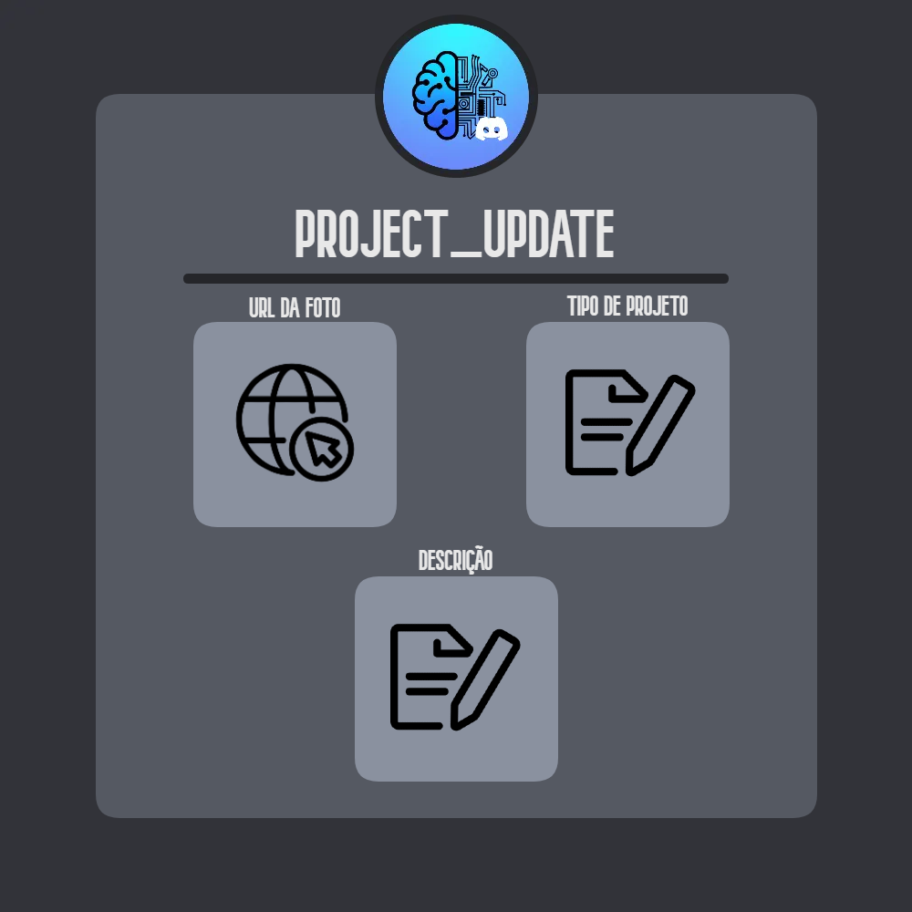

# PETBot

PETBot is a discord bot created to help managing and storing PET-SIMC related information.<br>
Uses MongoDB as main form of storage.


<h1>Features:</h1>

<ul>
    <li>Member Register / Update / Remove / Search</li>
    <li>Project Register / Update / Remove / Search</li>
</ul>

-----

<h3>Member Register</h3>
></img>
Using the "member_register" command you can register a new PET-SIMC member/ex-member.<br> 

-----

<h3>Member Update</h3>
></img>
Using the "member_update" command you can update a PET-SIMC member/ex-member information.<br>

-----

<h3>Member Remove</h3>
></img>
Using the "member_remove" command you can delete a PET-SIMC member/ex-member register.<br>

-----

<h3>Member Search</h3>
></img>
Using the "member_search" command you can retrieve a specific PET-SIMC member/ex-member register.<br>

-----

<h3>Project Register</h3>
></img>
Using the "project_register" command you can register a new PET-SIMC project.<br>
Photos are not downloaded to avoid limitations, use a stable photo url.  

-----

<h3>Project Update</h3>
></img>
Using the "project_update" command you can update a PET-SIMC project information.<br>
Photos are not downloaded to avoid limitations, use a stable photo url. 

-----

<h3>Project Remove</h3>
></img>
Using the "project_remove" command you can delete a PET-SIMC project register.<br>

-----

<h3>Project Search</h3>
></img>
Using the "project_search" command you can retrieve a specific PET-SIMC project register.<br>

-----

<h1>Instructions</h1>

<ul><h3>Requirements:</h3> 
    <li>PETApi</li>
    <li>Discord App</li>
</ul>


Insert a PETApi's deploy url into .env as show in .env.example.<br>
Create a Discord app in (https://discord.com/developers/applications) and insert it's token and client-id into .env as show in .env.example.

After setting up, you can start the project with: 

```bash
npm install
npm run dev
```
